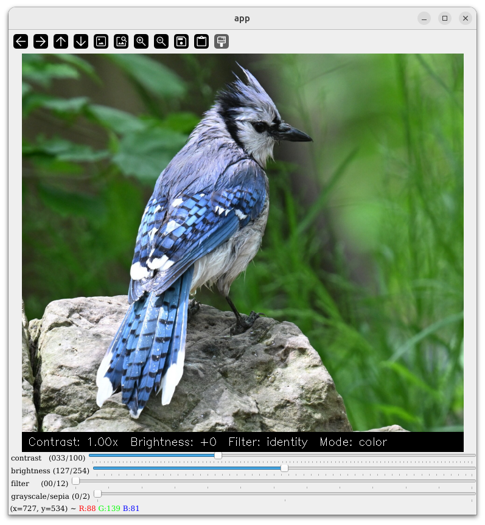
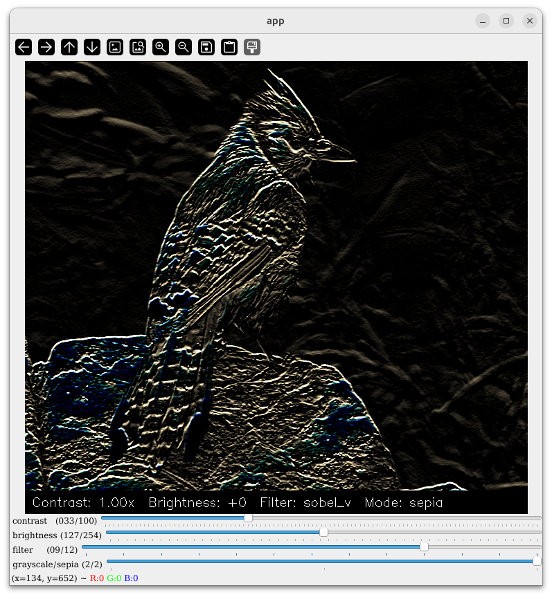

# Image Filters

An interactive image filter tool built with OpenCV and Tkinter. Adjust contrast, brightness, and convolution filters in real time via trackbars.




## Requirements

- Python 3 (version 3.12.3)
- opencv-python >=4.13.0.92
- numpy >=2.4.4

Install dependencies:

```bash
pip install opencv-python numpy
```
**Note (Linux):** tkinter requires `sudo apt install python3-tk`

**Note (Linux):** If trackbar labels are invisible, Qt fonts are missing. Fix:
```bash
wget https://github.com/dejavu-fonts/dejavu-fonts/releases/download/version_2_37/dejavu-fonts-ttf-2.37.tar.bz2
tar -xf dejavu-fonts-ttf-2.37.tar.bz2
mkdir -p ~/.local/lib/python3.12/site-packages/cv2/qt/fonts
cp dejavu-fonts-ttf-2.37/ttf/*.ttf ~/.local/lib/python3.12/site-packages/cv2/qt/fonts/
rm -rf dejavu-fonts-ttf-2.37*
```
Note the path may differ depending on your Python environment — adjust python3.12 to match yours.

## Usage

```bash
python3 app.py
```

A file dialog opens — select any JPEG, PNG, BMP, TIFF, or WebP image. The filter window appears with four trackbars:

| Trackbar | Range | Description |
|---|---|---|
| contrast | 0 – 100 | Multiplier mapped to 0× – ~3× (centre = 1×) |
| brightness | 0 – 254 | Offset mapped to −127 … +127 |
| filter | 0 – 12 | Convolution kernel (see below) |
| grayscale/sepia | 0 – 2 | 0 = color, 1 = grayscale, 2 = sepia |

### Keyboard shortcuts

| Key | Action |
|---|---|
| `a` | Quick-save current view to `output_N.png` beside the source image (note: it will replace old session quick saved images) |
| `s` | Save-as dialog |
| `q` | Quit |

Closing the window also exits the app.

## Available filters

| Index | Name | Effect |
|---|---|---|
| 0 | identity | No change |
| 1 | sharpen | Edge enhancement |
| 2 | unsharp | Unsharp masking |
| 3 | gaussian3 | Gaussian blur (3×3) |
| 4 | gaussian5 | Gaussian blur (5×5) |
| 5 | box | Box (average) blur |
| 6 | scharr_h | Scharr horizontal edges |
| 7 | scharr_v | Scharr vertical edges |
| 8 | sobel_h | Sobel horizontal edges |
| 9 | sobel_v | Sobel vertical edges |
| 10 | diag1 | Diagonal edge (↘) |
| 11 | diag2 | Diagonal edge (↗) |
| 12 | ridge | Ridge / Laplacian detection |

## Test image

`test.png` is a Blue Jay photo from iNaturalist ([observation #289942297](https://www.inaturalist.org/observations/289942297)), released under the CC0 license.
